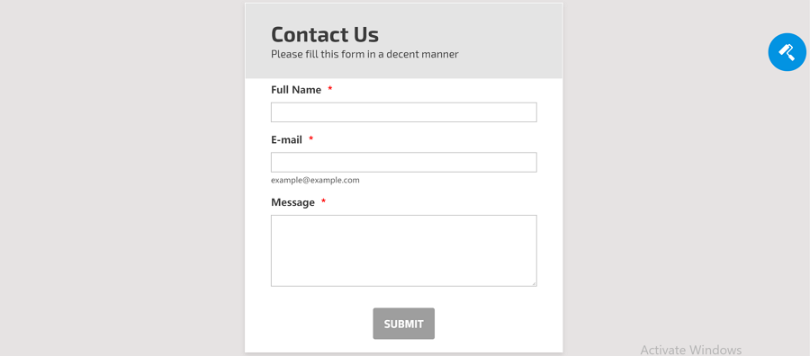

# Web Development in Java

## Learn
* Java Application Server
* [Servlet & JSP Tutorial](https://www.youtube.com/watch?v=OuBUUkQfBYM)

## Project
Contact us page with JSP, Servlet & PostgreSQL
* /contactus
  * show contact us page
  * store contact us info in database on click of submit button
* /admin/login
  * show admin login page
* /admin/contactus/requests
  * redirect to this page after admin logs in
  * fetch & show all requests info from database
    * group requests by active & archived
  * provide an option to archive each request

Contact us page should have 3 fields - full name, email and message.

